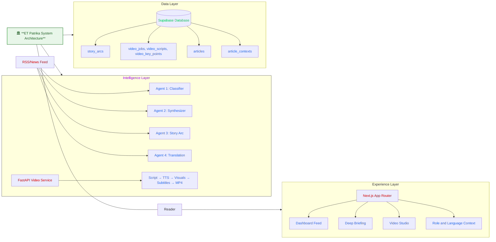

<p align="center">
  
</p>

<p align="center">
  
</p>

<p align="center">
  <a href="https://your-live-demo-url.com">
et-patrika.vercel.app
  </p>

  </a>
  
  
  
  
  
</p>

> The problem
"Business news in 2026 is still delivered like it's 2005 — static text, one-size-fits-all, same format for everyone."

The same RBI rate cut article is read by a 22-year-old student in Jaipur anxious about placements, a Mumbai HNI investor scanning for sector signals, a Bengaluru founder recalculating runway, and a school teacher in Dhubri wondering about her EMI. They get identical text written for nobody in particular. No platform has ever quantified how the same economic event creates winners and losers simultaneously across India's economic classes.


> The Solution
> "ET Patrika reframes the same event for students, investors, founders, and citizens".  
> The result is faster understanding, sharper action, and more trustworthy context.

## At a Glance

<table>
  <tr>
    <td align="center"><strong>4</strong><br />role lenses</td>
    <td align="center"><strong>5</strong><br />languages in flow</td>
    <td align="center"><strong>3</strong><br />core surfaces</td>
    <td align="center"><strong>35-90s</strong><br />video explainers</td>
  </tr>
</table>

## Role Switch

ET Patrika keeps the facts fixed and changes the framing.

| Role | Explainability | Market Signal | Builder Signal | Civic Signal | Best For |
| --- | --- | --- | --- | --- | --- |
| Student | 🟩🟩🟩🟩🟩 | 🟩⬜⬜⬜⬜ | 🟩🟩⬜⬜⬜ | 🟩🟩🟩⬜⬜ | learning the story fast |
| Investor | 🟩🟩🟩⬜⬜ | 🟩🟩🟩🟩🟩 | 🟩🟩🟩⬜⬜ | 🟩🟩⬜⬜⬜ | tracking risk and momentum |
| Founder | 🟩🟩🟩⬜⬜ | 🟩🟩🟩⬜⬜ | 🟩🟩🟩🟩🟩 | 🟩🟩⬜⬜⬜ | spotting product and execution angles |
| Citizen | 🟩🟩🟩🟩⬜ | 🟩⬜⬜⬜⬜ | 🟩🟩⬜⬜⬜ | 🟩🟩🟩🟩🟩 | understanding public impact |


## Architecture


Cancel
Comment

---

# Technical Deep Dives

<details>
  <summary><strong>1. Role-aware intelligence model</strong></summary>

  ET Patrika stores one canonical article, then expands it into role-specific `article_contexts`.
  Each context can hold a custom headline, why-it-matters summary, analogy, relevance score, action cards, and watch-outs.
  That makes the frontend fast because it mostly renders persisted intelligence instead of rebuilding it on every request.

</details>

<details>
  <summary><strong>2. Feed, briefing, and chat experience</strong></summary>

  The Next.js app routes users into a role-reactive dashboard, a deep briefing page, and a watch page for generated videos.
  The briefing view combines synthesis, story arcs, entity tags, and an article-level chat widget for follow-up questions.
  User state is guest-safe, so role and language preferences can persist even without a full auth flow.

</details>

<details>
  <summary><strong>3. Video Studio pipeline</strong></summary>

  FastAPI orchestrates script generation, TTS, chart and visual assembly, subtitle creation, and final MP4 composition.
  Fast mode targets roughly 35-45 second explainers, while standard mode targets roughly 60-90 seconds.
  Generated outputs are cached through `video_jobs`, `video_scripts`, and `video_key_points` so repeat viewing is cheaper and faster.
</details>

<details>
  <summary><strong>4. Autonomous scheduling and failure recovery</strong></summary>

  APScheduler runs the full pipeline every 15 minutes without human intervention.
  A `/api/ingest` webhook handles breaking news instantly — article URL in, role contexts out, under 60 seconds.
  Per-article failure isolation means one bad API response never stops the pipeline.
  Every synthesis run is logged to `synthesis_runs` with model, latency, attempt count, and validation result.

</details>

---

---

What ET Patrika Changes for Economic Times


## Revenue Model

### Layer 1 — Advertising premium

```
Standard ET pageview CPM          ₹180
Role-identified ET Patrika CPM    ₹420–600  (verified audience segment)
                                  ──────────────────────────────────────
Uplift per impression             2.3× – 3.3×

At 5M users, 4 sessions/month, 3 ads/session:
Standard:    600M impressions × ₹0.18  =  ₹10.8 Cr / month
ET Patrika:  600M impressions × ₹0.50  =  ₹30.0 Cr / month
                                            ──────────────────
Incremental ad revenue                     ₹19.2 Cr / month
```

The CPM uplift assumption is conservative. LinkedIn charges 4–5× standard display CPM for role-verified audiences. ET Patrika creates an equivalent signal from news reading behavior.

---

### Layer 2 — Subscription tier

| Tier | Price | What it includes | Target user |
|---|---|---|---|
| Free | ₹0 | 5 briefings/day, standard synthesis, English only | Casual reader |
| Deep Briefing | ₹99/month | Unlimited briefings, full story arc history, video explainers, 5 languages | Student |
| Pro Investor | ₹999/month | All above + conflict_index alerts, portfolio-linked signals, API access | Investor |
| Founder Intel | ₹499/month | All above + competitor tracking, regulatory change alerts, custom role weights | Founder |

```
Conversion assumption: 1% of 50M free users subscribe (industry standard for freemium news)
= 5 lakh subscribers

Blended ARPU at tier mix (70% Deep Briefing, 20% Pro, 10% Founder):
= (3.5L × ₹199) + (1L × ₹599) + (0.5L × ₹999)
= ₹69.65 Cr + ₹59.9 Cr + ₹49.95 Cr
= ₹179.5 Cr ARR at 1% conversion
```

---

### Layer 3 — conflict_index data licensing

The conflict_index time series — how contentious each economic event was across India's income classes — does not exist anywhere else. After 12 months of daily ingestion it becomes a research asset.

| Buyer | Use case | Deal size |
|---|---|---|
| Economic research firms (CRISIL, ICRA) | Policy impact modeling | ₹25–50L / year per firm |
| Political consultancies | Voter sentiment correlation | ₹20–40L / engagement |
| SEBI / RBI research division | Retail investor behavior analysis | Government contract |
| International funds (emerging markets desk) | India economic volatility signal | $50K–200K / year |
| Academic institutions (IIM, ISB, IGIDR) | Research dataset access | ₹2–8L / institution |

This revenue stream requires zero additional engineering. The data is a byproduct of the core product.

---

## Current Stack and the Upgrade Path

Every component in the current pipeline runs on free or near-zero-cost infrastructure. This was a deliberate choice — prove the mechanism works before paying for scale. Here is what runs today and what replaces it when ET launches this at scale.

### Agent 1 — Classifier

| | Current | At ET scale |
|---|---|---|
| Model | Gemini 2.5 Flash (free tier) | Gemini 2.5 Pro or Claude 3.5 Haiku for classification |
| Feed | RSS polling every 15 minutes | ET's internal CMS webhook — zero latency on publish |
| Volume | ~10 articles / day | 500–1000 articles / day across all ET properties |
| Bottleneck | Rate limits on free tier | None — ET has existing Google Cloud relationship |

### Agent 2 — Rashomon Synthesizer

| | Current | At ET scale |
|---|---|---|
| Model | Groq llama 3.3 | Gemini 2.5 Pro/Open AI  for synthesis, Flash for retries |
| Latency | 8–15 seconds per article | 4–6 seconds with Pro throughput tier |
| Quality gate | 8-check validator, retry once | Same validator, parallel synthesis for top 10% conflict_index articles |
| Languages | English synthesis only | Hindi synthesis native (Gemini Pro multilingual) |

### Agent 3 — Story Arc

| | Current | At ET scale |
|---|---|---|
| Model | Groq llama 3.3 | Gemini 3.1 Pro for cross-article reasoning |
| Arc depth | Single topic clustering | Entity graph across 6 months of ET archive |
| Player tracking | Named entities per article | Full knowledge graph — company → CEO → policy → market reaction |

### Agent 4 — Translation

| | Current | At ET scale |
|---|---|---|
| Engine | Sarvam AI  | Sarvam AI (voice model) native multilingual — cultural adaptation, not word-for-word translation |
| Languages | Hindi, Bengali, Assamese, Tamil | All 22 scheduled Indian languages |
| Limitation | Literal translation, loses Hinglish register | Re-synthesis in target language preserving persona voice |

### Video Studio

| | Current | At ET scale |
|---|---|---|
| TTS | Piper TTS (local, free) | Sarvam AI (voice model) or Azure Neural TTS — Indian accent voices |
| Video render | FFmpeg on pipeline server (720p) | Remotion.js cloud render — 1080p, parallel, 10 videos simultaneously |
| Script |  Groq  | Claude API  optimal |
| Storage | Supabase Storage free tier | Supabase Pro or Cloudflare R2 — CDN-served globally |
| Latency | 35–90 seconds | 15–40 seconds with cloud render workers |

### Hosting

| Layer | Current | At ET scale |
|---|---|---|
| Frontend | Vercel Hobby (free) | Vercel Pro or ET's existing AWS infrastructure |
| Pipeline | Local / Railway free tier | Dedicated compute — 4 vCPU, 8GB RAM handles 1000 articles/day |
| Database | Supabase free tier (500MB) | Supabase Pro (8GB) or ET's existing PostgreSQL cluster |
| Video CDN | Supabase Storage | Cloudflare R2 + CDN — ₹0.015 per GB egress |


## Quick Start

```bash
# Clone and install
git clone https://github.com/YOUR_USERNAME/et-patrika && cd et-patrika
npm install && pip install -r pipeline/requirements.txt

# Configure — copy examples, fill in your keys
cp .env.example .env.local
cp pipeline/.env.example pipeline/.env

# Run Supabase migrations — paste in SQL Editor, in order
# supabase/migrations/001_initial_schema.sql
# supabase/migrations/004_article_contexts.sql
# supabase/migrations/005_synthesis_runs.sql

# Start — three terminals
npm run dev                        # frontend → localhost:3000
python pipeline/scheduler.py       # autonomous pipeline, runs every 15 min
python pipeline/seed_demo_data.py  # seed 20 demo articles, first time only
```

**Required environment variables:**

| Variable | Source |
|---|---|
| `NEXT_PUBLIC_SUPABASE_URL` | Supabase Dashboard → Settings → API |
| `NEXT_PUBLIC_SUPABASE_ANON_KEY` | Same |
| `SUPABASE_SERVICE_ROLE_KEY` | Same — never expose client-side |
| `GOOGLE_AI_API_KEY` | aistudio.google.com → free tier |
| `SARVAM_API_KEY` | console.sarvamAI.com |
| `GROQ_API_KEY` | groq.api.com |
---

## Roadmap

| Phase | Timeline | What ships |
|---|---|---|
| **Shipped** | Now  | Rashomon Protocol · 4-role synthesis · conflict_index · autonomous pipeline · video studio · story arcs |
| **Phase 2** | 2026 | Engagement retuning agent — cross-session memory, role weights adapt to reading behavior |
| **Phase 3** | 2026 | Hindi, Tamil, Bengali, Telugu — re-synthesised in each language, not translated |
| **Phase 4** | 2026 | conflict_index API — licensed data product for research firms and policy institutions |
| **Phase 5** | 2026 | CMS integration — journalists write once, Rashomon generates all role editions automatically |

---

<p align="center">
  <sub>Built for the Avataar.ai × Economic Times AI Hackathon 2026 · MIT License</sub><br/>
  <a href="https://et-patrika.vercel.app">et-patrika.vercel.app</a>
  <br/><br/>
  <em>"The best demo is when a judge switches roles and goes quiet for two seconds."</em>
</p>


## Quick Start

```bash
cd et-patrika
npm install
# add .env.local and pipeline/.env with Supabase + model keys
npm run dev
python -m pip install -r pipeline/video_studio/requirements.txt
python -m uvicorn pipeline.video_studio.main:app --reload --port 8001
```

